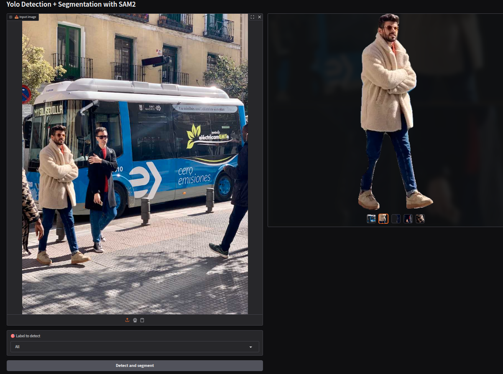

# YOLO + SAM Pipeline

This project provides a simple web interface to perform object detection using YOLO and segmentation using SAM (Segment Anything Model). The interface is built with Gradio and allows you to upload an image, select a label to detect, and get segmented masks for the detected objects.

---

## Example



---

## Features

- **YOLO Detection:** Detects objects in your image using a YOLO model.
- **Label Selection:** Choose which label/class you want to segment from the detected objects.
- **SAM Segmentation:** Segments each detected object using the Segment Anything Model.
- **Web Interface:** Easy-to-use Gradio interface.
- **Custom Training:** You can train your own YOLO model to detect new or custom labels/classes. See [Ultralytics YOLO documentation](https://docs.ultralytics.com/) for training instructions.

---

## Installation

1. **Clone the repository:**
   ```bash
   git clone <repo-url>
   cd yolo_sam_pipe
   ```

2. **Install dependencies:**
   ```bash
   pip install -r requirements.txt
   ```

3. **Download YOLO and SAM models:**

   Download the weights and place them in the `models/` directory:

   - **YOLOv8n:**  
     [Download yolov8n.pt](https://github.com/ultralytics/assets/releases/download/v0.0.0/yolov8n.pt)  
     or via terminal:  
     ```bash
     wget -O models/yolo.pt https://github.com/ultralytics/assets/releases/download/v0.0.0/yolov8n.pt
     ```

   - **SAM (Ultralytics format):**  
     [Download sam_b.pt](https://github.com/ultralytics/assets/releases/download/v8.1.0/sam_b.pt)  
     or via terminal:  
     ```bash
     wget -O models/sam2_b.pt https://github.com/ultralytics/assets/releases/download/v8.1.0/sam_b.pt
     ```

---

## Usage

Start the Gradio app:
```bash
python app.py
```

- Upload an image.
- Select the label/class you want to segment (or "All" for all classes).
- Click **Detect and segment**.
- View and download the resulting masks.

---

## File Structure

- `app.py` — Main Gradio interface.
- `yolo_utils.py` — YOLO detection utilities.
- `sam_utils.py` — SAM segmentation utilities.
- `requirements.txt` — Python dependencies.
- `models/` — Place your YOLO and SAM model weights here.

---

## Notes


- The segmentation masks are returned as transparent PNGs (RGBA).
- **Custom YOLO models:** You can train your own YOLO model to detect new objects or classes, then use the resulting weights in this pipeline.

---

## License

MIT License

---

## Credits

- [Ultralytics YOLO](https://github.com/ultralytics/ultralytics)
- [Meta Segment Anything](https://github.com/facebookresearch/segment-anything)
- [Gradio](https://gradio.app/)